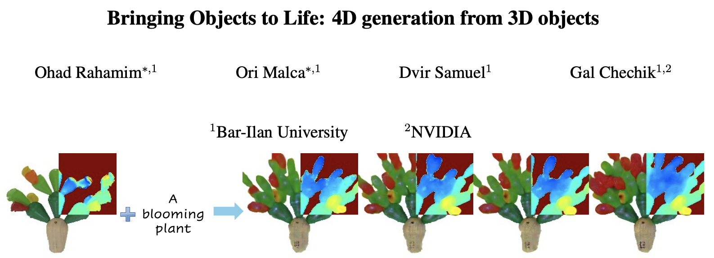
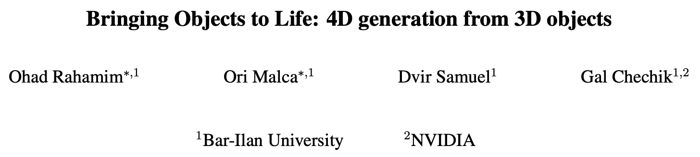
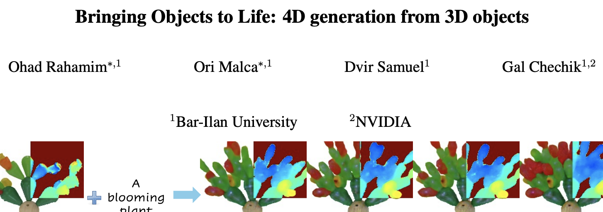
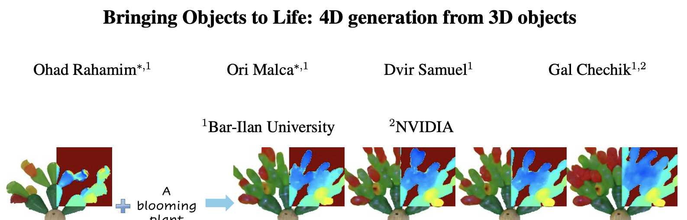
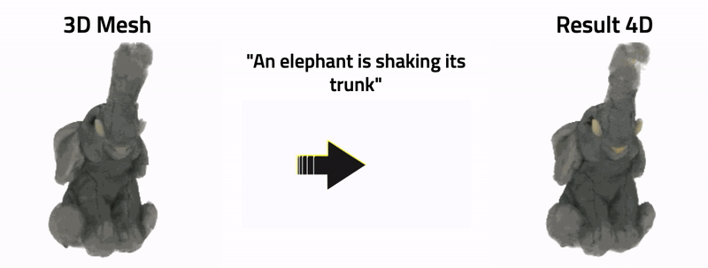
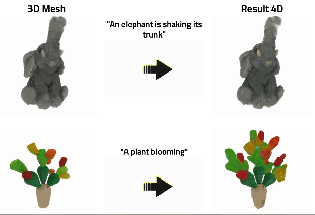
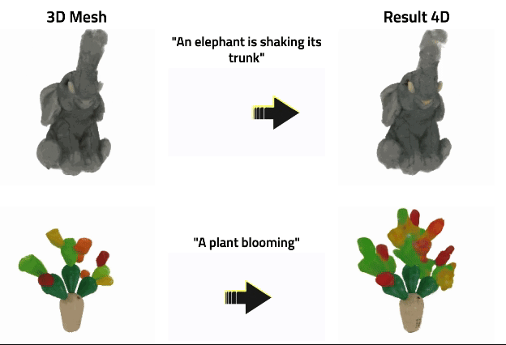
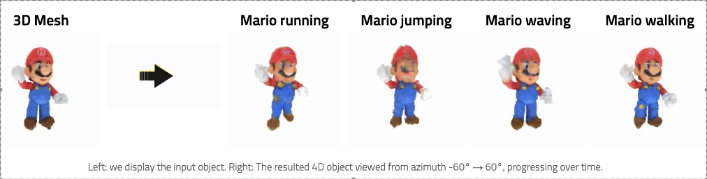
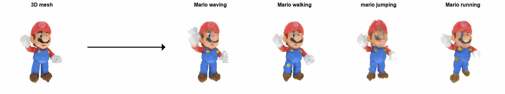

# 👋 Hello
I'm Ori, a Master's student in Computer Science at [Bar-Ilan University](https://www.biu.ac.il/en) in Israel, researching Deep Learning with a focus on Computer Vision, under the supervision of [Prof. Gal Chechik](https://chechiklab.biu.ac.il/~gal/), head of the [Learning Systems Lab](https://chechiklab.biu.ac.il/) and [NVIDIA Research Group IL](https://research.nvidia.com/labs/par/).

# ⭐ Recent Highlights
<!-- <strong><ins>3to4D</ins></strong>: A method for animating user-provided 3D objects by conditioning on textual prompts to guide 4D generation  -->
<h3><ins>3to4D</ins>: A method for animating 3D objects by conditioning on textual prompts to guide 4D generation</h3>

<!--    -->
<!--    -->
<!--    -->
<!--    -->
<!--    -->
  
<!--    -->
<!--    -->
<!--    -->
<!--   <figure style="text-align: center;"></figure> -->
   
<!--    -->
<!--    -->
  
  
<!--    -->
  
<!--   previously it was  -->
  
<!--    -->

<!--- 
Previous was:
- Bringing Objects to Life: 4D generation from 3D objects &nbsp;[ [📑 arXiv](https://arxiv.org/abs/2412.20422) • [🌐 Project Page](https://3-to-4d.github.io/3-to-4d/) • [🤗 Hugging Face](https://huggingface.co/papers/2412.20422) • [💻 Code](https://github.com/ohad204/3to4D) ]
--->

# 💬 Contact Me

<!--   Feel free to reach out for discussions or if you are interested in my work! -->
<!--      -->
  
Feel free to reach out for discussions or if you are interested in my work!

  

  <!--    -->
  <!--    -->
<!--      -->
    
  <!--    -->
  <!--    -->
<!--      -->
    
  <!--    -->
  <!--    -->
<!--      -->
    
<!--    -->
    
  <!--    -->
<!--      -->
    
  <!--- TODO: add link to **🌐 Personal Website --->
  

<!---
NOTES
1. posibile emoji's for "Connect with Me" part: [💬, 👥, 🌏, 🙋‍♂️, 😀, 🔗, 🖇️, 🔁, 🙌]
2. for badges refer to https://github.com/inttter/md-badges
3. templates for example in https://github.com/durgeshsamariya/awesome-github-profile-readme-templates/tree/master/templates
4. to create badge link refer to https://shields.io/badges
TODOS
1. Remove space between headings to content underwards to make it look more clear.
--->
