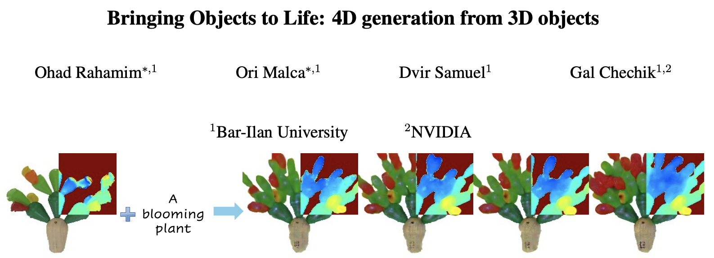

## 👋 Hello
I'm Ori, a Master's student in Computer Science at Bar-Ilan University in Israel, researching Deep Learning with a focus on Computer Vision under the supervision of Prof. Gal Chechik, head of the [Learning Systems Lab](https://chechiklab.biu.ac.il/) and [Nvidia Research Group IL](https://research.nvidia.com/labs/par/).

## ⭐ Recent Highlights

  
   
<!--    -->
<!--    -->
  
  
<!--    -->
  
<!--   previously it was  -->
  
<!--    -->

<!--- 
Previous was:
- Bringing Objects to Life: 4D generation from 3D objects &nbsp;[ [📑 arXiv](https://arxiv.org/abs/2412.20422) • [🌐 Project Page](https://3-to-4d.github.io/3-to-4d/) • [🤗 Hugging Face](https://huggingface.co/papers/2412.20422) • [💻 Code](https://github.com/ohad204/3to4D) ]
--->

## 💬 Connect with Me
- **📧 Email**: [orimalca2@gmail.com](mailto:orimalca2@gmail.com)
- **💼 LinkedIn**: [Visit my LinkedIn profile](https://www.linkedin.com/in/ori-malca/)
- **𝕏**: [Visit my 𝕏 profile](https://x.com/Orimalca)
- **🤗 Hugging Face**: [Visit my Hugging Face profile](https://huggingface.co/Orimalca)
<!--- **🌐 Personal Website:  --->

Feel free to reach out for discussions or if you are interested in my work!

<!--- NOTES
1. posibile emoji's for "Connect with Me" part: [💬, 👥, 🌏, 🙋‍♂️, 😀, 🔗, 🖇️, 🔁, 🙌]
--->
